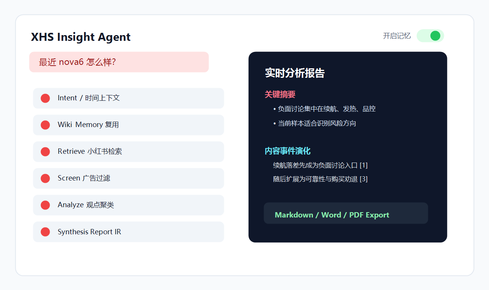
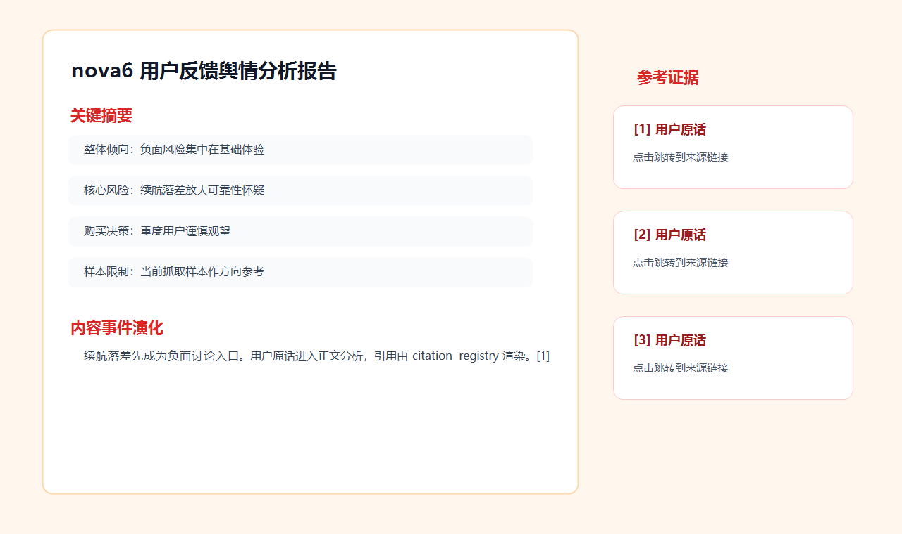

<div align="center">


# XHS Insight Agent

### A multi-agent public opinion analysis system for Xiaohongshu / RedNote

English | [中文文档](./README.md)


</div>

## Overview

XHS Insight Agent turns a product, brand, or event query into a traceable public opinion report. It understands user intent and temporal requirements, retrieves Xiaohongshu posts and comments, filters low-value content and ads, clusters user opinions, and renders a structured report with citations and export support.

It is not a single-prompt summarizer. The project combines **Wiki Memory**, **MCP Skill integration**, **evidence registry**, **Report IR**, **temporal retrieval**, and a **multi-agent workflow** designed specifically for Xiaohongshu product reputation analysis.

## Preview

| Web Console | Structured Report | MCP Skill |
| --- | --- | --- |
|  |  |  |

## Highlights

### Multi-Agent Division of Labor

The pipeline is split into dedicated agents:

- `Orchestrator`: intent, entity, key aspects, and temporal needs.
- `Retrieve`: Xiaohongshu search with sort strategy.
- `Screen`: ad filtering, brand-account filtering, and relevance ranking.
- `Analyze`: comments/post-body evidence, opinion clusters, and content-time analysis.
- `Synthesis`: Report IR generation, validation, and repair.

### Traceable Evidence

Post bodies and comments enter a unified evidence registry. Opinion clusters bind to `evidence_ids`, and report citations are rendered by a deterministic citation registry.

The `[1]` marks in the report are not free-form model output. They map back to source evidence, titles, and external links.

### Wiki Memory

The memory system follows the Karpathy Wiki idea: analysis results are compiled into reusable structured knowledge instead of cached Markdown.

- `EntityMemory` stores long-term memory for a product or brand.
- `ConsensusCluster` aggregates recurring opinion clusters across runs.
- `Evidence` stores raw posts or comments with content hashes for deduplication.
- `primary_aspects / sub_aspects / synonym_aspects` are precompiled during analysis, then reused with structured matching, BM25, and rule-based coverage decisions.
- Concept memory aggregates cross-entity topics such as battery, price, performance, quality, and camera.
- Trend and contradiction detection mark rising, falling, stable, new, sentiment split, and discussion spikes.

### Report IR

Reports are generated as structured `ReportIR` first, then rendered to Markdown, HTML, Word, or PDF.

The backend validates sections, citations, summary cards, data overview tables, insight-style headings, and content-time evolution to avoid thin template-like reports, while keeping web, Markdown, Word, and PDF outputs consistent.

### MCP Skill Entry

The system can run as both a web application and an MCP Skill for Claude Desktop / Cursor.

- `analyze_xhs_sentiment`: start a Xiaohongshu analysis from your AI editor.
- `configure_cookie`: encrypt and store your Xiaohongshu Cookie locally.
- The Skill checks and starts the backend automatically, consumes the SSE stream, and returns the final Markdown report.

### Temporal Retrieval

The system understands the time requirement in a query and uses it to shape retrieval and analysis, instead of guessing time changes during report writing.

Examples:

- `How is nova6 recently?` prioritizes fresher user feedback.
- `Reviews in the last six months` focuses on the requested time range.
- `Initial launch feedback` pays more attention to historically discussed content.
- `Is it still worth buying now?` compares old and new expressions to surface content evolution.

### Exportable Reports

- Markdown keeps headings, tables, citations, and references.
- Word is suitable for handoff and editing.
- PDF is rendered with WeasyPrint, with selectable text and real internal/external links.

## Why Not a Plain LLM Summary

| Capability | Plain LLM Summary | XHS Insight Agent |
| --- | --- | --- |
| Data source | Manually pasted text | Automatic Xiaohongshu post/comment retrieval |
| Filtering | Prompt-only | Rules + LLM soft-ad detection + relevance ranking |
| Memory | Usually none | Wiki Memory with entities, clusters, evidence, concepts |
| Time handling | Often inferred at report time | Understands time needs first, then adjusts retrieval, sample scope, and content-evolution analysis |
| Citations | Easy to lose or hallucinate | evidence registry + citation registry |
| Report structure | Markdown string | Structured Report IR |
| Export | Copy text | Markdown / Word / WeasyPrint PDF |
| Entry points | Usually one UI/script | Web UI + Claude/Cursor MCP Skill |

## Wiki Memory

The memory subsystem lives in `backend/app/memory` and `backend/app/utils/memory_retrieval.py`. Its goal is to preserve reusable knowledge, not just old reports.

```text
EntityMemory
├─ consensus_clusters[]
│  ├─ topic
│  ├─ sentiment
│  ├─ primary_aspects[]
│  ├─ sub_aspects[]
│  ├─ synonym_aspects[]
│  ├─ trend
│  └─ evidence_ids[]
├─ aspect_coverage
├─ contradictions
└─ recent_queries

Evidence
├─ content_hash
├─ note_id / note_url / note_title
├─ comment_id / nickname / like_count
└─ referenced_by[]
```

### Reuse Strategies

| Strategy | When | Behavior |
| --- | --- | --- |
| `full` | The current aspects are well covered by memory | Skip retrieval, screening, and clustering |
| `incremental` | Memory partially covers the query | Fetch fewer new posts and merge with reusable clusters |
| `none` | Coverage is too low or no memory exists | Run the full analysis pipeline |

The memory retrieval path does not rely on embeddings. It uses structured aspect tags, string rules, BM25, and coverage scoring, so each reuse decision can explain matched and missing aspects.

## Use It Inside Claude Desktop / Cursor

`skill-package` exposes the analysis system as an MCP Skill.

Example:

```text
Analyze iPhone 16 reputation on Xiaohongshu, enable memory reuse.
```

### Tools

| Tool | Purpose | Parameters |
| --- | --- | --- |
| `analyze_xhs_sentiment` | Run the analysis and return a Markdown report | `query`, `cookie`, `enable_memory` |
| `configure_cookie` | Configure or update the Xiaohongshu Cookie | `cookie` |

### Skill Features

- Automatically checks backend health and starts `backend/run.py` when needed.
- Reads Cookie from environment variables or encrypted local storage.
- Receives progress and results through SSE.
- Uses a 5-minute default timeout for deeper analysis jobs.

## Report System

The report system is implemented in `backend/app/models/report_ir.py` and `backend/app/reports`.

`ReportIR` is the structured source of truth. Markdown and PDF are derived artifacts, so headings, summary cards, tables, citations, and references stay consistent across media.

## Quick Start

### 1. Install dependencies

```bash
npm install
pip install -r backend/requirements.txt
```

### 2. Configure environment variables

Create `backend/.env`:

```env
XHS_COOKIES=your_xiaohongshu_cookie

LLM_PROVIDER=qianfan
QIANFAN_BEARER_TOKEN=your_qianfan_token
QIANFAN_BASE_URL=https://qianfan.baidubce.com/v2/chat/completions
QIANFAN_MODEL=ernie-4.5-21b-a3b

MCP_POOL_SIZE=2
ENABLE_MEMORY=false
```

For local mock mode:

```env
XHS_COOKIES=-1
```

### 3. Start backend

```bash
cd backend
python run.py
```

or:

```bash
cd backend
uvicorn app.main:app --reload
```

### 4. Start frontend

```bash
npm run dev
```

Open:

```text
http://localhost:8001/analysis
```

## Install MCP Skill

```bash
cd skill-package
pip install -r requirements.txt
python install.py
```

Restart Claude Desktop or Cursor after installation.

Configure Cookie on first use:

```text
Use configure_cookie with my Xiaohongshu Cookie: "your cookie"
```

Then run:

```text
Analyze Xiaomi EV reputation on Xiaohongshu, enable memory reuse.
```

## Project Structure

```text
my-vue3-vite-project/
├─ src/                         # Vue3 frontend, SSE progress, report rendering/export
├─ public/                      # Frontend static assets
├─ static/image/                # README banner and preview images
├─ backend/
│  ├─ app/
│  │  ├─ agents/                # Orchestrator / Retrieve / Screen / Analyze / Synthesis
│  │  ├─ memory/                # Wiki Memory
│  │  ├─ models/report_ir.py    # Report IR v1 models
│  │  ├─ reports/               # Markdown / HTML / PDF renderers
│  │  ├─ graph/                 # LangGraph workflow orchestration
│  │  ├─ tools/                 # LLM, MCP, Xiaohongshu, current-time tools
│  │  └─ api/                   # FastAPI routes
│  ├─ mcp_server/               # Xiaohongshu data MCP server
│  ├─ data/                     # Runtime memory data
│  └─ requirements.txt
├─ skill-package/               # Claude Desktop / Cursor MCP Skill
├─ Spider_XHS-master/           # Xiaohongshu crawler dependency
├─ README.md
└─ README-EN.md
```

## Data Source Note

Xiaohongshu data collection is implemented based on [Spider_XHS](https://github.com/cv-cat/Spider_XHS). Thanks to [@cv-cat](https://github.com/cv-cat) for the open-source contribution.

## Disclaimer

This project is for learning, research, and personal productivity exploration only. Please respect platform rules, data compliance requirements, and account safety. Do not use it for abuse, harassment, commercial scraping, or any activity that violates platform terms. Cookies are intended for local analysis workflows only; keep your login credentials safe.
