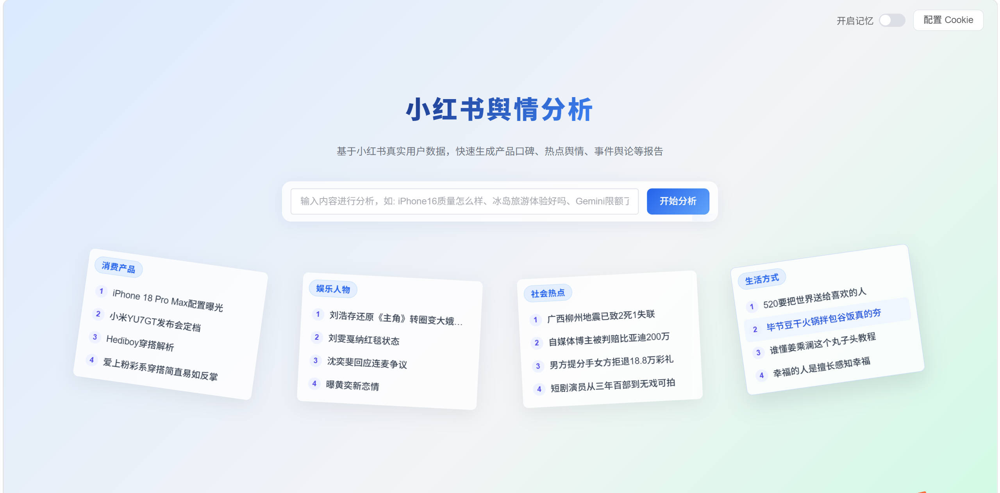
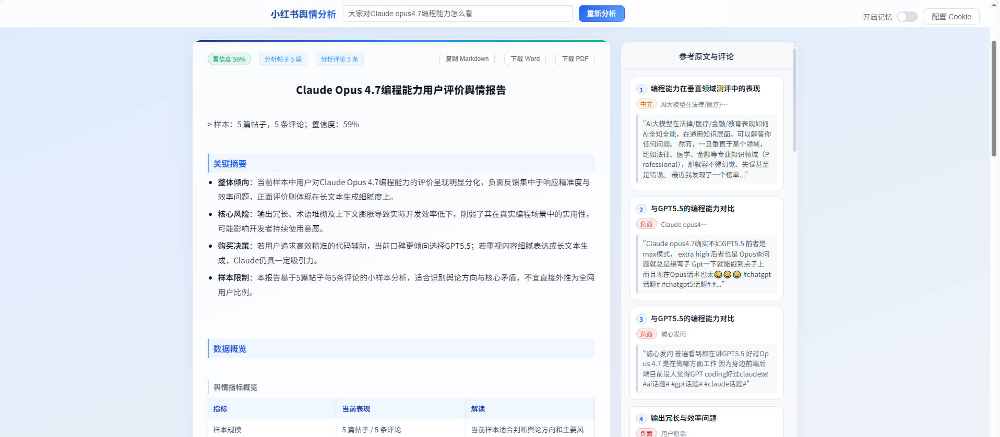
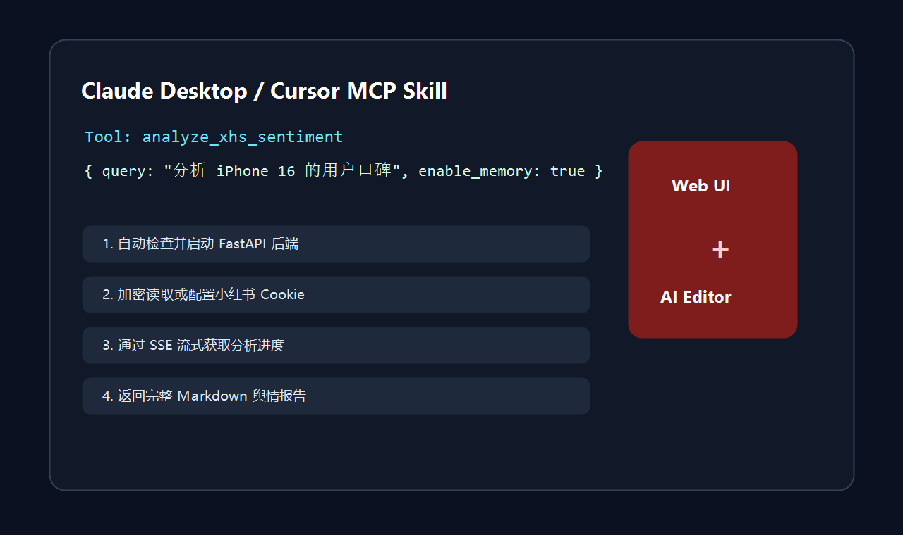

<div align="center">


# XHS Insight Agent

### 小红书舆情分析智能体

面向产品口碑、消费决策和热点事件的小红书多 Agent 舆情分析系统。

[English](./README-EN.md) | 中文文档


</div>

## 项目简介

XHS Insight Agent 输入一个产品、品牌或热点问题，就能自动理解用户意图和时间需求，检索小红书帖子与评论，过滤广告和低价值内容，聚类真实用户观点，并生成带证据引用、可导出、可复核的结构化舆情报告。

它不是单 prompt 总结器，而是一套围绕小红书口碑场景设计的工程化 Agent 系统：**Wiki Memory 长期记忆、MCP Skill 调用入口、证据注册表、Report IR 报告引擎、时间语义检索、多 Agent 工作流**共同组成完整分析链路。

## 效果预览

| Web 分析台 | 结构化报告 | MCP Skill |
| --- | --- | --- |
|  |  |  |

## 核心优势

### 多 Agent 分工

完整工作流由多个 Agent 协作完成：

- `Orchestrator`：识别意图、主体、关注点和时间需求。
- `Retrieve`：根据意图和时间策略检索小红书帖子。
- `Screen`：过滤广告、软广、品牌号、联系方式和低相关内容。
- `Analyze`：爬取评论或使用帖子正文，生成 evidence registry、观点簇和内容时间分析。
- `Synthesis`：基于 Report IR 生成结构化报告，并进行质量校验和修复。

### 证据可追溯

帖子正文和评论都会进入统一 evidence registry。观点簇绑定 `evidence_ids`，报告引用由后端 citation registry 确定性渲染。

这意味着报告中的 `[1]` 不是模型随手写的角标，而是可以回到参考证据、来源标题和外链的真实引用。

### Wiki Memory 记忆系统

项目内置基于 Karpathy Wiki 思路的记忆系统，把一次次分析沉淀为可复用的结构化知识，而不是简单缓存一段 Markdown。

- `EntityMemory` 保存产品或品牌维度的长期记忆。
- `ConsensusCluster` 聚合多次分析中反复出现的共识观点。
- `Evidence` 使用内容哈希去重，保留原始帖子正文或评论。
- 三层标签 `primary_aspects / sub_aspects / synonym_aspects` 在分析阶段预编译，检索阶段用结构化标签、BM25 和规则匹配完成复用决策。
- 概念记忆会把续航、价格、性能、品控等跨实体议题沉淀到 concept 页面。
- 趋势和矛盾检测用于识别 rising、falling、stable、新观点、情感分化和讨论激增。

### Report IR 报告引擎

报告先生成结构化 `ReportIR`，再渲染为 Markdown、HTML、Word 和 PDF。

后端会校验报告章节、引用、摘要卡片、数据概览、洞察型标题和内容事件演化，避免报告退化成模板化短句；同时确保网页、Markdown、Word 和 PDF 中的报告内容保持一致。

### MCP Skill 双入口

系统既可以作为 Web 应用使用，也可以作为 Claude Desktop / Cursor 的 MCP Skill 使用。

- `analyze_xhs_sentiment`：在 AI 编辑器里直接发起小红书舆情分析。
- `configure_cookie`：把小红书 Cookie 加密保存到本地。
- `check_xhs_runtime`：分析前检查 Python、Node、LLM、Cookie 和小红书 JS 依赖。
- Skill 默认直接运行本地多 Agent 工作流，不需要启动 Vue 前端或 FastAPI 后端服务。

### 时间语义驱动检索

系统会理解用户问题里的时间需求，并把它用于检索和分析策略，而不是等到写报告时再凭空推断。

例如：

- `最近 nova6 怎么样` -> 优先获取更新鲜的用户反馈。
- `近半年评价如何` -> 聚焦指定时间范围内的讨论。
- `发布初期评价` -> 更关注历史阶段的高讨论内容。
- `现在还值得买吗` -> 对比新旧表达，提炼内容事件演化。

### 可导出、可复核报告

- Markdown：保留标题、表格、引用和参考证据。
- Word：适合交付和二次编辑。
- PDF：使用 WeasyPrint 生成原生可选中文本 PDF，支持正文引用跳转和来源外链。

## 为什么不是普通 LLM 总结

| 维度 | 普通 LLM 总结 | XHS Insight Agent |
| --- | --- | --- |
| 数据来源 | 用户手动粘贴文本 | 自动检索小红书帖子与评论 |
| 内容筛选 | 基本依赖 prompt | 规则过滤 + LLM 软广识别 + 相关性排序 |
| 记忆能力 | 通常没有长期沉淀 | Wiki Memory：实体记忆、观点簇、证据、概念记忆 |
| 时间问题 | 容易在报告阶段脑补 | 先理解时间需求，再影响检索排序、样本范围和内容演化分析 |
| 引用证据 | 容易丢失或编造角标 | evidence registry + citation registry |
| 报告结构 | Markdown 字符串 | Report IR 结构化对象 |
| 导出能力 | 复制文本为主 | Markdown / Word / WeasyPrint PDF |
| 使用入口 | 单一网页或脚本 | Web UI + Claude/Cursor MCP Skill |

## Wiki Memory 详解

记忆系统位于 `backend/app/memory` 和 `backend/app/utils/memory_retrieval.py`。它的重点不是“存下报告”，而是把分析结果拆成可检索、可演化、可追溯的知识结构。

```text
EntityMemory
├─ consensus_clusters[]
│  ├─ topic
│  ├─ sentiment
│  ├─ primary_aspects[]
│  ├─ sub_aspects[]
│  ├─ synonym_aspects[]
│  ├─ trend
│  └─ evidence_ids[]
├─ aspect_coverage
├─ contradictions
└─ recent_queries

Evidence
├─ content_hash
├─ note_id / note_url / note_title
├─ comment_id / nickname / like_count
└─ referenced_by[]
```

### 复用策略

| 策略 | 触发逻辑 | 行为 |
| --- | --- | --- |
| `full` | 当前关注点被历史观点高覆盖 | 跳过检索、筛选和聚类，直接复用历史观点与证据 |
| `incremental` | 历史记忆部分覆盖当前问题 | 降低新抓取量，合并历史观点与新样本 |
| `none` | 覆盖不足或无历史记忆 | 完整执行全新分析流程 |

记忆检索不依赖 embedding。系统使用三层标签、字符串规则、BM25 关键词匹配和覆盖率规则来决定复用策略，因此每一次复用都能解释“命中了哪些关注点，缺失哪些关注点”。

## Use It Inside Claude Desktop / Cursor

`skill-package` 把整个分析系统封装为 MCP Skill。配置后，你可以在 Claude Desktop 或 Cursor 中直接输入：

```text
分析 iPhone 16 的用户口碑，开启记忆复用
```

### Skill 工具

| 工具 | 功能 | 参数 |
| --- | --- | --- |
| `check_xhs_runtime` | 检查本地运行环境 | 无 |
| `analyze_xhs_sentiment` | 直接运行多 Agent 分析并返回 Markdown 报告 | `query`, `cookie`, `enable_memory`, `return_report_ir`, `save_artifacts` |
| `configure_cookie` | 配置或更新小红书 Cookie | `cookie` |

### Skill 特性

- 默认直接 import 后端工作流并运行多 Agent，不占用 `8000/8030/5173` 等 Web 端口。
- Cookie 优先读取环境变量，也可以加密保存到本地。
- 可选保存 Markdown 和结构化结果到本地 artifacts。
- 默认 5 分钟分析超时，适合较长的小红书检索和评论分析任务。
- 仅当显式设置 `XHS_SKILL_MODE=remote` 时，才会调用已有 FastAPI 后端。

## 报告系统

报告系统位于 `backend/app/models/report_ir.py` 和 `backend/app/reports`。

`ReportIR` 是报告的结构化源数据，Markdown 和 PDF 都是派生产物。这样可以确保不同媒介中的章节、摘要、表格、引用和参考证据一致。

### 导出能力

- 前端支持复制 Markdown、下载 Word、下载 PDF。
- PDF 由后端 `/api/v1/export/pdf` 接口生成。
- WeasyPrint 负责 HTML 到 PDF 渲染，保留真实链接和可选择文本。

## Quick Start

### 1. 安装依赖

```bash
npm install
pip install -r backend/requirements.txt
```

### 2. 配置环境变量

在 `backend/.env` 中配置：

```env
XHS_COOKIES=你的小红书 Cookie

LLM_PROVIDER=qianfan
QIANFAN_BEARER_TOKEN=你的千帆 Token
QIANFAN_BASE_URL=https://qianfan.baidubce.com/v2/chat/completions
QIANFAN_MODEL=ernie-4.5-21b-a3b

# 可选：Longcat
# LONGCAT_BASE_URL=https://api.longcat.chat/openai/v1/chat/completions
# LONGCAT_MODEL=LongCat-Flash-Chat
# LONGCAT_API_KEY=你的 Longcat API Key

# 可选：ModelScope
# MODELSCOPE_BASE_URL=https://api-inference.modelscope.cn/v1
# MODELSCOPE_MODEL=MiniMax/MiniMax-M2.5
# MODELSCOPE_API_KEY=你的 ModelScope API Key

MCP_POOL_SIZE=2
ENABLE_MEMORY=false
```

本地无 Cookie 或只想跑通流程时，可以使用 Mock 模式：

```env
XHS_COOKIES=-1
```

### 3. 启动后端

```bash
cd backend
python run.py
```

或：

```bash
cd backend
uvicorn app.main:app --reload
```

### 4. 启动前端

```bash
npm run dev
```

默认访问：

```text
http://localhost:8001/analysis
```

## 安装 MCP Skill

### 1. 安装本地运行依赖

```bash
cd backend
.\.venv\Scripts\python.exe -m pip install -r requirements.txt

cd ..\Spider_XHS-master
npm install
```

Skill 默认直接调用本地多 Agent 工作流，因此 MCP 配置建议使用同一个 `backend/.venv` Python。

### 2. 自动注册到 Claude Desktop / Cursor

```bash
cd ..\skill-package
..\backend\.venv\Scripts\python.exe install.py
```

安装脚本会自动检测系统、定位配置文件、写入 MCP Server 配置。完成后重启 Claude Desktop 或 Cursor。

重启后建议先调用 `check_xhs_runtime`，确认本地依赖、LLM 配置、Cookie 和 Node 依赖都正常。

### 3. 首次配置 Cookie

在 Claude Desktop / Cursor 中调用：

```text
使用 configure_cookie 配置小红书 Cookie 为 "你的 Cookie 字符串"
```

随后即可调用：

```text
分析小米汽车的小红书口碑，开启记忆复用
```

## 项目结构

```text
my-vue3-vite-project/
├─ src/                         # Vue3 前端页面、SSE 进度流、报告展示和导出
├─ public/                      # 前端静态资源
├─ static/image/                # README Banner 和预览图
├─ backend/
│  ├─ app/
│  │  ├─ agents/                # Orchestrator / Retrieve / Screen / Analyze / Synthesis
│  │  ├─ memory/                # Wiki Memory：实体记忆、证据、概念、趋势、矛盾检测
│  │  ├─ models/report_ir.py    # Report IR v1 数据结构
│  │  ├─ reports/               # Markdown / HTML / PDF 渲染
│  │  ├─ graph/                 # LangGraph 工作流编排
│  │  ├─ tools/                 # LLM、MCP、小红书和当前时间工具
│  │  └─ api/                   # FastAPI 路由
│  ├─ mcp_server/               # 小红书数据抓取 MCP Server
│  ├─ data/                     # 运行时记忆数据
│  └─ requirements.txt
├─ skill-package/               # Claude Desktop / Cursor MCP Skill
│  ├─ skill_server.py
│  ├─ install.py
│  └─ config.py
├─ Spider_XHS-master/           # 小红书抓取依赖项目
├─ README.md
└─ README-EN.md
```

## 数据抓取说明

小红书数据采集基于 [Spider_XHS](https://github.com/cv-cat/Spider_XHS) 项目实现，感谢 [@cv-cat](https://github.com/cv-cat) 的开源贡献。

## Disclaimer

本项目仅供学习、研究和个人效率工具探索使用。请遵守目标平台规则、数据合规要求和账号安全规范，不要用于批量滥用、骚扰、商业爬取或任何违反平台条款的行为。Cookie 默认仅用于本地分析流程，请妥善保管个人登录态信息。
